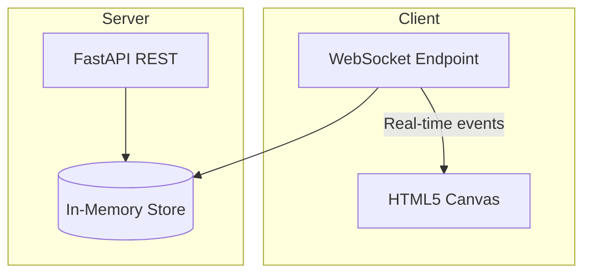
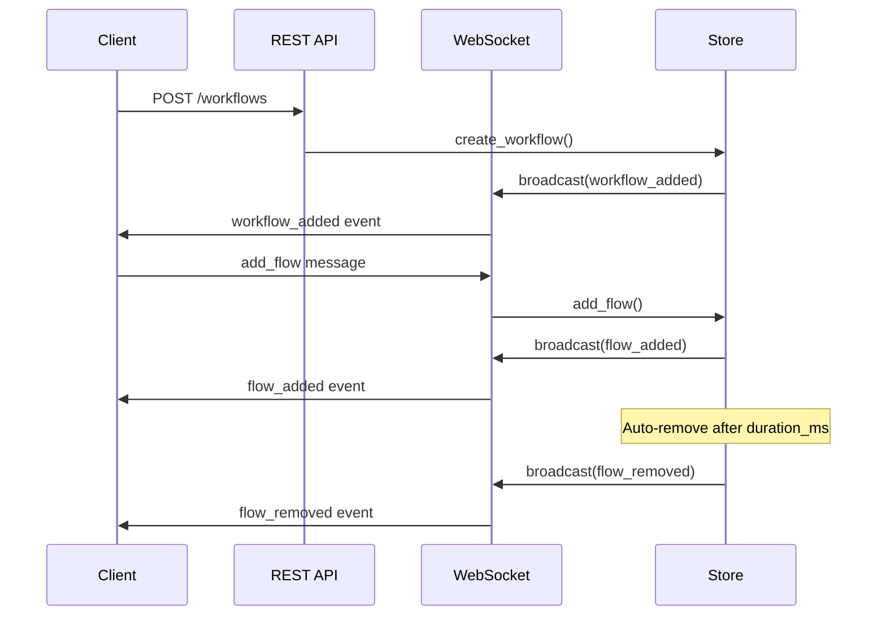

# Agent Visualization

A workflow visualization tool with a FastAPI backend and vanilla JS frontend. The backend provides REST APIs for workflow CRUD and a WebSocket endpoint for real-time flow animations. The frontend renders workflows on an HTML5 canvas with animated particles flowing along edge paths.

## Architecture



### Data Flow



## Project Structure

```
src/agent_vis/
├── __init__.py      # Public API exports
├── app.py           # FastAPI app, HTTP routes, WebSocket
├── config.py        # Pydantic settings (host, port, debug)
├── exceptions.py    # Custom exception hierarchy
├── models.py        # Pydantic models
└── store.py         # WorkflowStore (in-memory), broadcast logic

frontend/
├── index.html
├── app.js           # Canvas rendering, force-directed layout
└── styles.css

tests/
├── conftest.py      # Test fixtures
├── test_api.py      # REST API tests
└── test_e2e.py      # End-to-end browser tests
```

## How to Run

```bash
# Install dependencies
uv sync

# Run the server
uv run uvicorn src.agent_vis.app:app --reload

# Run tests
pytest

# Run a specific test
pytest tests/test_api.py::test_create_workflow

# Lint / format
ruff check .
ruff check --fix .
ruff format .

# Type check
mypy src/agent_vis
```

## Demo Scripts

With the server running, try the showcase demos:

```bash
python showcase.py basic      # Single flow
python showcase.py parallel   # Multiple parallel flows
python showcase.py sequential # Sequential flows
python showcase.py loop       # Continuous flows
python showcase.py cleanup    # Delete all workflows
```

## Configuration

Copy `.env.example` to `.env` and adjust:

- `HOST` - Server host (default: 0.0.0.0)
- `PORT` - Server port (default: 8000)
- `DEBUG` - Debug mode (default: false)
